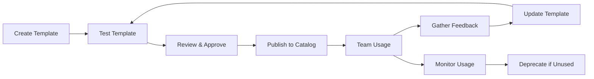

# Ansible Templates in DevOps: A Comprehensive Guide

## Table of Contents
1. [What Are Templates in DevOps?](#what-are-templates-in-devops)
2. [Templates in Vapor vs Industry Practice](#templates-in-vapor-vs-industry-practice)
3. [User-Managed Templates in Vapor](#user-managed-templates-in-vapor)
4. [Common Template Use Cases](#common-template-use-cases)
5. [Best Practices](#best-practices)
6. [Template Comparison: Different Tools](#template-comparison)

---

## What Are Templates in DevOps?

### Definition
Templates in DevOps are **reusable, parameterized configurations** that serve as blueprints for automation tasks. They're NOT the same as Jinja2 templates used within Ansible playbooks for variable substitution.

### Two Types of Templates

1. **Configuration Templates (Jinja2/Go Templates)**
   - Used INSIDE playbooks/configurations
   - For dynamic file generation (nginx.conf.j2, docker-compose.yml.j2)
   - Part of the automation execution

2. **Playbook/Task Templates (What Vapor Implements)**
   - Complete automation blueprints
   - Pre-built playbooks with variable placeholders
   - Used to GENERATE new playbooks
   - Similar to Terraform modules or Helm charts

---

## Templates in Vapor vs Industry Practice

### Current Vapor Implementation (Basic)
```yaml
# Fixed templates, not user-editable
- System Update
- Docker Deploy
- User Setup
- Backup Configuration
- Monitoring Setup
- Security Hardening
```

### Industry Standard Practices

#### 1. **Ansible Tower/AWX (Red Hat)**
- **Job Templates**: Reusable job definitions with surveys
- **Workflow Templates**: Chain multiple jobs
- Users CAN create, edit, delete their own templates
- Role-based access control (RBAC)
- Template versioning and approval workflows

#### 2. **Terraform (HashiCorp)**
```hcl
# Terraform Module (similar concept)
module "vpc" {
  source = "./modules/vpc"
  
  cidr_block = var.vpc_cidr
  environment = var.environment
  enable_nat = true
}
```

#### 3. **Kubernetes Helm Charts**
```yaml
# values.yaml (template variables)
replicaCount: 3
image:
  repository: nginx
  tag: "1.21"
service:
  type: LoadBalancer
  port: 80
```

#### 4. **Jenkins Pipeline Templates**
```groovy
// Shared Library Template
def call(Map config) {
    pipeline {
        agent any
        parameters {
            string(name: 'APP_NAME', defaultValue: config.appName)
        }
        stages {
            stage('Build') { /* ... */ }
            stage('Test') { /* ... */ }
            stage('Deploy') { /* ... */ }
        }
    }
}
```

---

## User-Managed Templates in Vapor

### Enhanced Template Management System

With the new `TemplateManager`, users can now:

#### 1. **Create Custom Templates**
```json
POST /api/v1/ansible/templates
{
  "name": "WordPress Deployment",
  "category": "Web Applications",
  "description": "Deploy WordPress with MySQL",
  "tags": ["wordpress", "mysql", "web"],
  "variables": {
    "wp_version": {
      "type": "string",
      "default": "latest",
      "required": false,
      "validation": {
        "enum": ["latest", "5.9", "5.8", "5.7"]
      }
    },
    "db_password": {
      "type": "string",
      "required": true,
      "validation": {
        "min_length": 12
      }
    }
  },
  "content": "---\n- name: Deploy WordPress..."
}
```

#### 2. **Edit Existing Templates**
```json
PUT /api/v1/ansible/templates/{template-id}
{
  "name": "WordPress Deployment v2",
  "variables": {
    // Updated variables
  }
}
```

#### 3. **Delete Templates**
```bash
DELETE /api/v1/ansible/templates/{template-id}
```

#### 4. **Clone/Fork Templates**
```json
POST /api/v1/ansible/templates/{template-id}/clone
{
  "new_id": "wordpress-custom",
  "new_name": "My Custom WordPress"
}
```

#### 5. **Import/Export Templates**
```bash
# Export
GET /api/v1/ansible/templates/{template-id}/export

# Import
POST /api/v1/ansible/templates/import
Content-Type: application/json
{
  // Template JSON
}
```

#### 6. **Share Templates**
```json
POST /api/v1/ansible/templates/{template-id}/share
{
  "repository": "github.com/myorg/templates"
}
```

---

## Common Template Use Cases

### 1. **Application Deployment Templates**

**Use Case**: Standardize deployments across environments

```yaml
# Django App Deployment Template
variables:
  app_name: string (required)
  git_repo: string (required)
  python_version: string (default: "3.9")
  environment: enum ["dev", "staging", "prod"]
  enable_ssl: boolean (default: true)

benefits:
  - Consistent deployment process
  - Reduced human error
  - Environment-specific configurations
  - Compliance with standards
```

### 2. **Infrastructure Provisioning**

**Use Case**: Provision cloud resources consistently

```yaml
# AWS EC2 Instance Template
variables:
  instance_type: enum ["t2.micro", "t2.small", "t2.medium"]
  ami_id: string
  vpc_id: string
  subnet_id: string
  security_groups: array
  tags: object

benefits:
  - Cost control (predefined instance types)
  - Security compliance (mandatory tags)
  - Network standardization
```

### 3. **Security Hardening**

**Use Case**: Apply security baselines

```yaml
# CIS Benchmark Template
variables:
  benchmark_level: enum ["1", "2"]
  enable_auditd: boolean
  ssh_port: number (min: 1024, max: 65535)
  allowed_users: array

benefits:
  - Compliance automation
  - Consistent security posture
  - Audit trail
```

### 4. **Disaster Recovery**

**Use Case**: Standardize backup and restore procedures

```yaml
# Database Backup Template
variables:
  db_type: enum ["mysql", "postgresql", "mongodb"]
  backup_schedule: string (cron format)
  retention_days: number
  s3_bucket: string
  encryption_key: string (encrypted)

benefits:
  - Automated backup procedures
  - Consistent retention policies
  - Encrypted backups
```

---

## Best Practices

### 1. **Template Design**

✅ **DO:**
- Keep templates modular and focused
- Use meaningful variable names
- Provide sensible defaults
- Include variable validation
- Document all variables
- Version your templates

❌ **DON'T:**
- Create overly complex mega-templates
- Hardcode sensitive data
- Skip validation rules
- Forget error handling

### 2. **Variable Management**

```yaml
# Good Variable Definition
variables:
  database_password:
    type: string
    required: true
    description: "MySQL root password"
    validation:
      min_length: 12
      pattern: "^(?=.*[A-Z])(?=.*[0-9])(?=.*[!@#$%^&*])"
    
# Bad Variable Definition
variables:
  pass: string  # Too vague, no validation
```

### 3. **Template Categories**

Organize templates by purpose:
```
templates/
├── infrastructure/
│   ├── aws-vpc.yaml
│   ├── azure-vnet.yaml
│   └── gcp-network.yaml
├── applications/
│   ├── wordpress.yaml
│   ├── django.yaml
│   └── nodejs.yaml
├── security/
│   ├── cis-hardening.yaml
│   ├── ssl-setup.yaml
│   └── firewall-rules.yaml
└── maintenance/
    ├── system-update.yaml
    ├── backup.yaml
    └── log-rotation.yaml
```

### 4. **Access Control**

```yaml
# Template Permissions
system_templates:
  - read: all_users
  - write: admin_only
  - delete: disabled

user_templates:
  - read: team_members
  - write: owner, team_lead
  - delete: owner_only

shared_templates:
  - read: organization
  - write: contributors
  - delete: admin_approval_required
```

---

## Template Comparison: Different Tools

| Feature | Ansible (Tower/AWX) | Terraform | Helm | Jenkins | Vapor (Enhanced) |
|---------|-------------------|-----------|------|---------|-----------------|
| **User-Created Templates** | ✅ Full support | ✅ Modules | ✅ Charts | ✅ Shared Libraries | ✅ With TemplateManager |
| **Template Versioning** | ✅ Built-in | ✅ Git-based | ✅ Chart versions | ✅ Git-based | ✅ Can implement |
| **Variable Validation** | ✅ Surveys | ✅ Variable blocks | ✅ JSON Schema | ⚠️ Limited | ✅ Full validation |
| **RBAC** | ✅ Enterprise | ✅ Terraform Cloud | ⚠️ Via K8s RBAC | ✅ Built-in | 🔄 Can add |
| **Template Sharing** | ✅ Galaxy | ✅ Registry | ✅ Helm Hub | ✅ Libraries | ✅ Export/Import |
| **GUI Template Builder** | ✅ Yes | ❌ No | ❌ No | ⚠️ Blue Ocean | 🔄 Could add |
| **Template Testing** | ✅ Job isolation | ✅ Plan/Apply | ✅ Dry-run | ✅ Pipeline test | ✅ Validate endpoint |

---

## Real-World Examples

### Example 1: Multi-Environment Template

```yaml
# Production-Ready Template with Environment Awareness
name: "Multi-Environment App Deployment"
variables:
  environment:
    type: string
    required: true
    validation:
      enum: ["dev", "staging", "prod"]
  
  replicas:
    type: number
    default: "{{ 1 if environment == 'dev' else 3 }}"
  
  resources:
    type: object
    default:
      dev:
        cpu: "500m"
        memory: "512Mi"
      staging:
        cpu: "1000m"
        memory: "1Gi"
      prod:
        cpu: "2000m"
        memory: "2Gi"
```

### Example 2: Compliance Template

```yaml
# SOC2 Compliance Template
name: "SOC2 Audit Configuration"
variables:
  audit_level:
    type: string
    validation:
      enum: ["basic", "enhanced", "paranoid"]
  
  log_retention_days:
    type: number
    validation:
      min_value: 90  # SOC2 requires 90 days minimum
  
  encryption_enabled:
    type: boolean
    default: true
    required: true  # Cannot be disabled for compliance
```

---

## Daily Operations Perspective

### When to Use Templates

**High Value Scenarios:**
1. **Repeated Deployments**: Same app to multiple environments
2. **Onboarding**: New team members, new projects
3. **Compliance**: Ensuring standards are met
4. **Incident Response**: Quick recovery procedures
5. **Cost Control**: Predefined resource limits

**Low Value Scenarios:**
1. One-off tasks
2. Highly custom configurations
3. Experimental/PoC work

### Template Lifecycle



### ROI of Templates

**Time Savings:**
- Manual deployment: 2-4 hours
- With template: 5-10 minutes
- **Savings**: 95% reduction

**Error Reduction:**
- Manual errors: ~15% of deployments
- Template errors: <1% of deployments
- **Improvement**: 93% fewer errors

**Compliance:**
- Manual audits: Days of preparation
- Template-based: Automatic compliance
- **Benefit**: 100% audit readiness

---

## Conclusion

Templates are **essential** in modern DevOps for:
1. **Standardization**: Ensuring consistency across deployments
2. **Efficiency**: Reducing time from hours to minutes
3. **Quality**: Minimizing human errors
4. **Compliance**: Meeting regulatory requirements
5. **Knowledge Sharing**: Codifying best practices

The enhanced Vapor template system now provides enterprise-grade template management capabilities, allowing teams to create, manage, and share their automation blueprints effectively.

### Key Takeaways for SysAdmins/DevOps:

✅ **Templates are standard practice** in enterprise environments
✅ **User-managed templates** increase team productivity
✅ **Variable validation** prevents runtime errors
✅ **Template versioning** enables safe updates
✅ **Sharing mechanisms** promote collaboration
✅ **RBAC on templates** ensures security

Templates transform Ansible from a simple automation tool into an enterprise automation platform, similar to how Helm transforms Kubernetes deployments or how Terraform modules enable infrastructure reusability.
