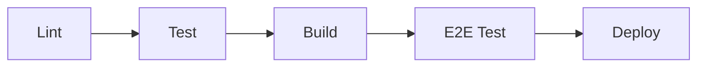

# GitLab CI/CD Pipeline Documentation

## Overview

The Vapor project uses a comprehensive GitLab CI/CD pipeline to ensure code quality, test coverage, and reliable deployments. The pipeline consists of multiple stages that run various types of tests and checks before building and deploying the application.

## Pipeline Stages

The pipeline is organized into the following stages:



### 1. Lint Stage (Parallel Jobs)

Runs code quality checks in parallel for fast feedback:

- **`lint:golangci`** - Comprehensive Go linting with golangci-lint
- **`lint:security`** - Security vulnerability scanning with gosec
- **`lint:fmt`** - Go code formatting validation

### 2. Test Stage (Parallel Jobs)

Executes different types of tests in parallel:

- **`test:unit`** - Unit tests with race detection and coverage reporting
- **`test:integration`** - Integration tests with system dependencies
- **`test:api`** - API endpoint tests with a running server

### 3. Build Stage

Creates artifacts for deployment:

- **`build:binary`** - Builds Linux x86_64 binary
- **`build:docker`** - Builds and saves Docker image

### 4. E2E Test Stage

Runs end-to-end tests with full environment:

- **`e2e:docker-compose`** - Full stack testing with Docker Compose
- **`e2e:performance`** - Performance testing (optional, can fail)

### 5. Deploy Stage

Deploys the application:

- **`deploy:docker`** - Pushes Docker images to registry
- **`deploy:docs`** - Deploys documentation

## Configuration

### Environment Variables

Key variables used across the pipeline:

```yaml
GO_VERSION: "1.24"              # Go version for builds
GOLANGCI_LINT_VERSION: "v1.54.2" # Linter version
TEST_TIMEOUT: "10m"              # Test execution timeout
COVERAGE_THRESHOLD: "60"         # Minimum code coverage percentage
```

### Caching

The pipeline uses caching to speed up builds:

- Go modules cache: `.go/pkg/mod/`
- Go build cache: `.go-cache/`

### Artifacts

Each job produces artifacts that are stored:

- **Test Results**: JUnit XML reports for GitLab test reporting
- **Coverage Reports**: HTML and Cobertura format coverage reports
- **Docker Images**: Compressed Docker images for deployment
- **Logs**: Service logs from E2E tests

## Job Details

### Lint Jobs

#### lint:golangci
- Uses `.golangci.yml` configuration
- Checks for code smells, bugs, and style issues
- Produces code quality report for merge requests

#### lint:security
- Scans for security vulnerabilities
- Reports issues as SAST findings in GitLab
- Focuses on medium and high severity issues

#### lint:fmt
- Ensures consistent code formatting
- Fails if any files need reformatting

### Test Jobs

#### test:unit
- Runs all unit tests with race detection
- Generates coverage reports
- Enforces minimum coverage threshold (60%)
- Coverage displayed in merge request

#### test:integration
- Tests with real system dependencies
- Requires Docker, SQLite, and Linux utilities
- Uses integration build tags

#### test:api
- Builds and starts API server
- Runs API test scripts
- Validates endpoints and authentication

### Build Jobs

#### build:binary
- Cross-compiles for Linux x86_64
- Creates standalone binary
- Includes embedded web assets

#### build:docker
- Multi-stage Docker build
- Uses BuildKit for caching
- Tags with branch and commit SHA
- Saves image as artifact

### E2E Test Jobs

#### e2e:docker-compose
- Spins up full development environment
- Includes Docker-in-Docker, K3s, iSCSI
- Runs smoke and integration tests
- Collects service logs

#### e2e:performance
- Load testing with performance scripts
- Allowed to fail (non-blocking)
- Generates performance metrics

## Running Tests Locally

### Using the CI Test Script

A helper script is provided to run CI stages locally:

```bash
# Run all CI stages
./scripts/ci-test-local.sh all

# Run specific stage
./scripts/ci-test-local.sh lint
./scripts/ci-test-local.sh unit
./scripts/ci-test-local.sh integration
./scripts/ci-test-local.sh api
./scripts/ci-test-local.sh e2e
./scripts/ci-test-local.sh docker
```

### Manual Testing

```bash
# Lint check
golangci-lint run --timeout 5m

# Unit tests with coverage
go test -v -race -coverprofile=coverage.out ./...
go tool cover -html=coverage.out -o coverage.html

# Integration tests
go test -v -tags=integration ./internal/tests/...

# E2E tests with Docker Compose
cd development
docker-compose up -d
docker-compose exec vapor-api-dev ./test/smoke_test.sh
docker-compose down -v
```

## Pipeline Triggers

The pipeline runs on:

- **Merge Requests**: Lint and test stages
- **Main Branch**: Full pipeline including deployment
- **Dev Branch**: Full pipeline except production deployment

## Best Practices

### For Developers

1. **Run tests locally** before pushing:
   ```bash
   ./scripts/ci-test-local.sh unit
   ```

2. **Fix linting issues** before commit:
   ```bash
   golangci-lint run --fix
   gofmt -w .
   ```

3. **Check coverage** for new code:
   ```bash
   go test -coverprofile=coverage.out ./...
   go tool cover -html=coverage.out
   ```

### For CI/CD

1. **Keep jobs focused** - Each job should have a single responsibility
2. **Use parallelization** - Run independent jobs in parallel
3. **Cache dependencies** - Speed up builds with proper caching
4. **Fail fast** - Critical jobs should fail early
5. **Generate artifacts** - Store test results and reports

## Troubleshooting

### Common Issues

#### 1. Lint failures
```bash
# Fix formatting
gofmt -w .

# Check specific linter issues
golangci-lint run --enable-only=gosec
```

#### 2. Test failures
```bash
# Run specific test
go test -v -run TestSpecificFunction ./internal/auth/

# Debug with more output
go test -v -race -count=1 ./...
```

#### 3. Coverage below threshold
```bash
# Find uncovered code
go tool cover -html=coverage.out

# Add tests for specific package
go test -cover ./internal/container/
```

#### 4. Docker build failures
```bash
# Build locally
docker build -t vapor:test .

# Check build context
docker build --no-cache -t vapor:test .
```

## GitLab Integration Features

### Merge Request Integration
- Inline code quality comments
- Coverage percentage display
- Test report summary
- Security vulnerability alerts

### Pipeline Visualization
- DAG view for parallel jobs
- Pipeline graph for dependencies
- Job timings and resource usage

### Monitoring
- Pipeline duration trends
- Success rate metrics
- Most failed jobs report

## Security Considerations

1. **Secrets Management**
   - Use GitLab CI/CD variables for sensitive data
   - Never commit secrets to repository
   - Rotate credentials regularly

2. **Image Scanning**
   - Scan Docker images for vulnerabilities
   - Use trusted base images
   - Keep dependencies updated

3. **Access Control**
   - Limit deployment permissions
   - Use protected branches
   - Require approval for production deploys

## Future Improvements

- [ ] Add mutation testing
- [ ] Implement dependency scanning
- [ ] Add browser-based E2E tests
- [ ] Integrate with external monitoring
- [ ] Add automatic rollback on failure
- [ ] Implement blue-green deployments
- [ ] Add performance regression detection
- [ ] Create deployment environments in GitLab

## References

- [GitLab CI/CD Documentation](https://docs.gitlab.com/ee/ci/)
- [golangci-lint Configuration](https://golangci-lint.run/usage/configuration/)
- [Go Testing Best Practices](https://golang.org/doc/test)
- [Docker Build Best Practices](https://docs.docker.com/develop/dev-best-practices/)
