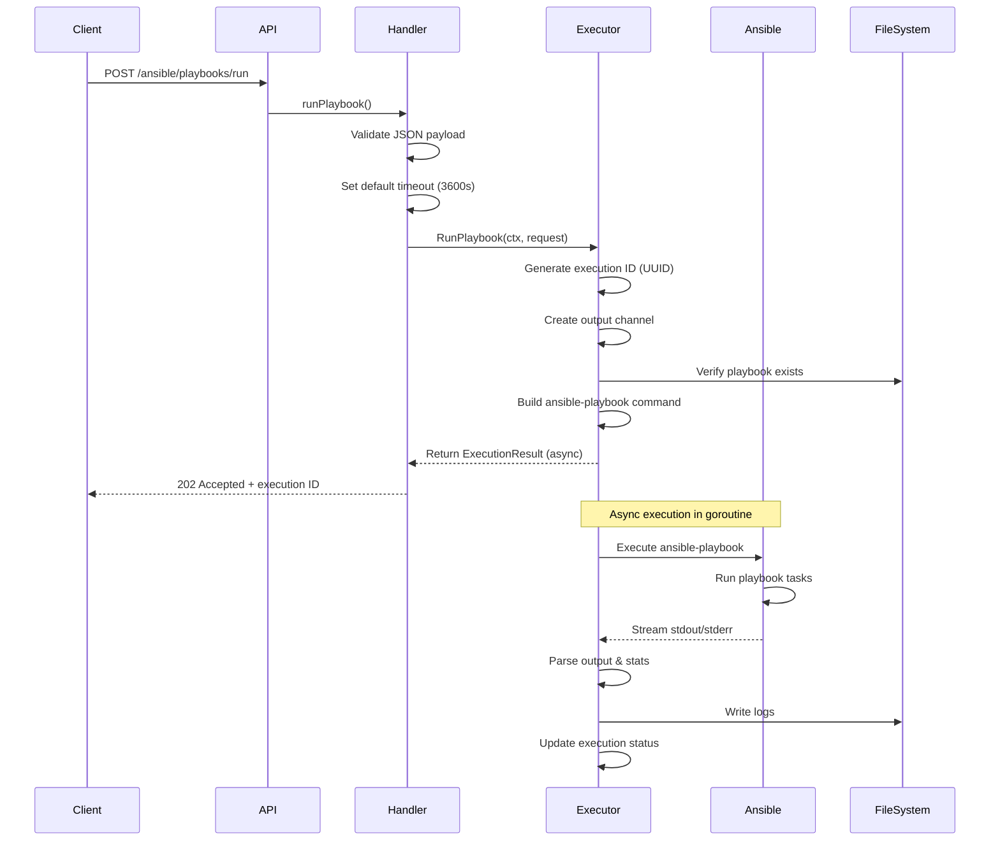

# Technical Deep Dive: `/ansible/playbooks/run` Endpoint

## Overview

The `/ansible/playbooks/run` endpoint is the core automation execution endpoint in Vapor API. It allows users to execute Ansible playbooks asynchronously with real-time output streaming, comprehensive configuration options, and execution tracking.

---

## API Endpoint Details

### HTTP Method & Route
```
POST /api/v1/ansible/playbooks/run
```

### Authentication
- Requires JWT Bearer token
- Token should be passed in `Authorization` header

### Response Status Codes
- `202 Accepted` - Playbook execution started successfully (async)
- `400 Bad Request` - Invalid request payload
- `500 Internal Server Error` - Server-side execution error

---

## Request Flow Architecture



---

## Request Payload Structure

```json
{
  "playbook": "deploy-app.yml",           // Required: Playbook filename
  "inventory": "production",              // Required: Inventory name or path
  "limit": "web-servers",                 // Optional: Limit hosts/groups
  "tags": ["deploy", "configure"],        // Optional: Run only tagged tasks
  "skip_tags": ["test"],                  // Optional: Skip tagged tasks
  "extra_vars": {                         // Optional: Additional variables
    "app_version": "2.1.0",
    "environment": "production",
    "debug_mode": false
  },
  "become": true,                          // Optional: Privilege escalation
  "become_user": "root",                  // Optional: Target user for become
  "forks": 10,                            // Optional: Parallel execution (default: 5)
  "verbosity": 2,                         // Optional: 0-4 (0=normal, 4=debug)
  "check": false,                          // Optional: Dry-run mode
  "diff": true,                           // Optional: Show file changes
  "vault_pass": "secret123",              // Optional: Ansible vault password
  "private_key": "/path/to/key",          // Optional: SSH private key path
  "timeout": 1800,                        // Optional: Execution timeout (seconds)
  "callback_url": "https://webhook.url"   // Optional: Webhook for completion
}
```

### Field Explanations

| Field | Type | Default | Description |
|-------|------|---------|-------------|
| `playbook` | string | - | Playbook filename relative to playbooks directory |
| `inventory` | string | - | Inventory file or dynamic inventory script |
| `limit` | string | - | Restrict execution to specific hosts/groups |
| `tags` | []string | - | Only run tasks with these tags |
| `skip_tags` | []string | - | Skip tasks with these tags |
| `extra_vars` | object | {} | Pass additional variables to playbook |
| `become` | bool | false | Enable privilege escalation (sudo/su) |
| `become_user` | string | root | User to become when using privilege escalation |
| `forks` | int | 5 | Number of parallel processes |
| `verbosity` | int | 0 | Output verbosity (0=normal, 4=connection debug) |
| `check` | bool | false | Run in check mode (dry-run) |
| `diff` | bool | false | Show differences for changed files |
| `vault_pass` | string | - | Password for encrypted vault files |
| `private_key` | string | - | SSH private key for authentication |
| `timeout` | int | 3600 | Maximum execution time in seconds |
| `callback_url` | string | - | Webhook URL for completion notification |

---

## Internal Processing Steps

### 1. **Request Validation** (Handler Layer)
```go
// routes/ansible.go - Line 54-59
var req ansible.PlaybookRequest
if err := c.ShouldBindJSON(&req); err != nil {
    c.JSON(http.StatusBadRequest, gin.H{"error": err.Error()})
    return
}
```

### 2. **Execution ID Generation**
```go
// executor.go - Line 133
execID := uuid.New().String()  // Generate unique execution ID
```

### 3. **Command Building Process**
```go
// executor.go - Lines 148-229
args := []string{}

// Core playbook path
playbookPath := filepath.Join(e.playbookDir, req.Playbook)
args = append(args, playbookPath)

// Inventory specification
if req.Inventory != "" {
    args = append(args, "-i", filepath.Join(e.inventoryDir, req.Inventory))
}

// Host limiting
if req.Limit != "" {
    args = append(args, "--limit", req.Limit)
}

// Tag filtering
if len(req.Tags) > 0 {
    args = append(args, "--tags", strings.Join(req.Tags, ","))
}

// Variable injection
if len(req.ExtraVars) > 0 {
    varsJSON, _ := json.Marshal(req.ExtraVars)
    args = append(args, "--extra-vars", string(varsJSON))
}

// Privilege escalation
if req.Become {
    args = append(args, "--become")
    if req.BecomeUser != "" {
        args = append(args, "--become-user", req.BecomeUser)
    }
}

// Performance tuning
if req.Forks > 0 {
    args = append(args, "--forks", fmt.Sprintf("%d", req.Forks))
}

// Verbosity level (-v, -vv, -vvv, -vvvv)
if req.Verbosity > 0 {
    verbosity := strings.Repeat("v", req.Verbosity)
    args = append(args, fmt.Sprintf("-%s", verbosity))
}
```

### 4. **Asynchronous Execution**
```go
// executor.go - Line 232
go e.executeCommand(ctx, "ansible-playbook", args, result, outputChan, req.Timeout)
```

The execution happens in a goroutine, allowing the API to return immediately with a 202 Accepted status.

### 5. **Output Streaming**
```go
// executor.go - Lines 346-365
// Stdout reader goroutine
go func() {
    scanner := bufio.NewScanner(stdout)
    for scanner.Scan() {
        line := scanner.Text()
        result.Output = append(result.Output, line)
        outputChan <- line  // Stream to WebSocket subscribers
    }
}()

// Stderr reader goroutine (similar)
```

### 6. **Environment Configuration**
```go
// executor.go - Lines 313-317
cmd.Env = append(os.Environ(),
    "ANSIBLE_HOST_KEY_CHECKING=False",        // Skip SSH host key verification
    "ANSIBLE_RETRY_FILES_ENABLED=False",      // Don't create .retry files
    fmt.Sprintf("ANSIBLE_LOG_PATH=%s/%s.log", e.logDir, result.ID),
)
```

### 7. **Statistics Parsing**
```go
// executor.go - Lines 396-434
// Parse PLAY RECAP section for execution statistics
// Example output parsing:
// web-01 : ok=15 changed=3 unreachable=0 failed=0 skipped=2
```

---

## Response Structure

### Immediate Response (202 Accepted)
```json
{
  "id": "550e8400-e29b-41d4-a716-446655440000",
  "type": "playbook",
  "status": "running",
  "start_time": "2024-01-20T10:30:00Z",
  "output": []
}
```

### Complete Execution Result (via GET /executions/{id})
```json
{
  "id": "550e8400-e29b-41d4-a716-446655440000",
  "type": "playbook",
  "status": "success",
  "start_time": "2024-01-20T10:30:00Z",
  "end_time": "2024-01-20T10:35:23Z",
  "duration": 323.5,
  "output": [
    "PLAY [Deploy Application] ***",
    "TASK [Gathering Facts] ***",
    "ok: [web-01]",
    "ok: [web-02]",
    "TASK [Deploy application code] ***",
    "changed: [web-01]",
    "changed: [web-02]",
    "PLAY RECAP ***",
    "web-01 : ok=15 changed=3 unreachable=0 failed=0 skipped=2",
    "web-02 : ok=15 changed=3 unreachable=0 failed=0 skipped=2"
  ],
  "exit_code": 0,
  "stats": {
    "web-01": {
      "ok": 15,
      "changed": 3,
      "unreachable": 0,
      "failed": 0,
      "skipped": 2
    },
    "web-02": {
      "ok": 15,
      "changed": 3,
      "unreachable": 0,
      "failed": 0,
      "skipped": 2
    }
  },
  "changed": true,
  "unreachable": [],
  "failed": []
}
```

---

## Real-Time Output Streaming

### WebSocket Connection
```javascript
// Client-side WebSocket connection for real-time output
const ws = new WebSocket('ws://localhost:8080/api/v1/ansible/executions/{id}/stream');

ws.onmessage = (event) => {
  const data = JSON.parse(event.data);
  if (data.type === 'output') {
    console.log(data.content);  // Real-time playbook output
  } else if (data.type === 'complete') {
    console.log('Execution completed:', data.result);
  }
};
```

### Output Channel Architecture
```go
// Buffered channel for streaming (100 line buffer)
outputChan := make(chan string, 100)

// Output flows:
// Ansible Process → stdout/stderr → Scanner → Output Channel → WebSocket
```

---

## Security Considerations

### 1. **Playbook Path Validation**
```go
// Prevents directory traversal attacks
playbookPath := filepath.Join(e.playbookDir, req.Playbook)
if _, err := os.Stat(playbookPath); err != nil {
    return nil, fmt.Errorf("playbook not found: %s", req.Playbook)
}
```

### 2. **Vault Password Handling**
```go
// Temporary file for vault password (deleted after use)
vaultFile, err := e.createTempVaultPass(req.VaultPass)
defer os.Remove(vaultFile)
```

### 3. **Environment Isolation**
- Each execution has unique ID
- Separate log files per execution
- Controlled environment variables

### 4. **Timeout Protection**
```go
// Prevents runaway executions
ctx, cancel = context.WithTimeout(ctx, time.Duration(timeout)*time.Second)
defer cancel()
```

---

## Performance Optimizations

### 1. **Parallel Execution**
- Default: 5 forks
- Configurable up to system limits
- Reduces execution time for multiple hosts

### 2. **Output Buffering**
- 100-line buffer prevents blocking
- Async streaming to clients
- In-memory storage for recent executions

### 3. **Resource Management**
```go
// Goroutine management
var wg sync.WaitGroup
wg.Add(2)  // stdout and stderr readers
// Ensures clean shutdown
```

---

## Error Handling

### Common Error Scenarios

1. **Playbook Not Found**
   - Status: 500
   - Message: "playbook not found: {name}"

2. **Invalid JSON Payload**
   - Status: 400
   - Message: Specific validation error

3. **Timeout Exceeded**
   - Execution killed after timeout
   - Status marked as "failed"
   - Exit code: -1

4. **Ansible Execution Failure**
   - Exit code captured
   - Full error output preserved
   - Failed hosts tracked

---

## Monitoring & Debugging

### Log Files
```
/ansible/logs/{execution-id}.log
```
Contains detailed Ansible output with timestamps.

### Execution History
```bash
GET /api/v1/ansible/executions
```
Lists all past executions with status and statistics.

### Debug Verbosity Levels
- `0`: Normal output
- `1` (`-v`): Show task results
- `2` (`-vv`): Show task input
- `3` (`-vvv`): Show connection attempts
- `4` (`-vvvv`): Show connection debugging

---

## Usage Examples

### 1. **Simple Deployment**
```bash
curl -X POST http://localhost:8080/api/v1/ansible/playbooks/run \
  -H "Authorization: Bearer $TOKEN" \
  -H "Content-Type: application/json" \
  -d '{
    "playbook": "deploy-app.yml",
    "inventory": "production"
  }'
```

### 2. **Deployment with Variables**
```bash
curl -X POST http://localhost:8080/api/v1/ansible/playbooks/run \
  -H "Authorization: Bearer $TOKEN" \
  -H "Content-Type: application/json" \
  -d '{
    "playbook": "deploy-app.yml",
    "inventory": "production",
    "extra_vars": {
      "version": "2.1.0",
      "rollback": false
    },
    "tags": ["deploy"],
    "limit": "web-servers"
  }'
```

### 3. **Dry-Run Mode**
```bash
curl -X POST http://localhost:8080/api/v1/ansible/playbooks/run \
  -H "Authorization: Bearer $TOKEN" \
  -H "Content-Type: application/json" \
  -d '{
    "playbook": "system-update.yml",
    "inventory": "all-servers",
    "check": true,
    "diff": true,
    "verbosity": 2
  }'
```

### 4. **High-Performance Execution**
```bash
curl -X POST http://localhost:8080/api/v1/ansible/playbooks/run \
  -H "Authorization: Bearer $TOKEN" \
  -H "Content-Type: application/json" \
  -d '{
    "playbook": "configure-cluster.yml",
    "inventory": "kubernetes",
    "forks": 50,
    "timeout": 7200,
    "become": true
  }'
```

---

## Integration Patterns

### 1. **CI/CD Pipeline Integration**
```yaml
# GitLab CI example
deploy:
  script:
    - |
      EXECUTION_ID=$(curl -X POST $VAPOR_API/ansible/playbooks/run \
        -H "Authorization: Bearer $VAPOR_TOKEN" \
        -d '{"playbook": "deploy.yml", "inventory": "prod"}' \
        | jq -r '.id')
    - |
      while true; do
        STATUS=$(curl $VAPOR_API/ansible/executions/$EXECUTION_ID \
          -H "Authorization: Bearer $VAPOR_TOKEN" \
          | jq -r '.status')
        if [ "$STATUS" != "running" ]; then break; fi
        sleep 5
      done
```

### 2. **Webhook Notifications**
```json
{
  "playbook": "backup.yml",
  "inventory": "databases",
  "callback_url": "https://slack.webhook.url/notify"
}
```

### 3. **Scheduled Automation**
```javascript
// Node.js scheduled task
const cron = require('node-cron');

cron.schedule('0 2 * * *', async () => {
  await fetch('http://vapor-api/ansible/playbooks/run', {
    method: 'POST',
    headers: {
      'Authorization': `Bearer ${token}`,
      'Content-Type': 'application/json'
    },
    body: JSON.stringify({
      playbook: 'nightly-backup.yml',
      inventory: 'production'
    })
  });
});
```

---

## Limitations & Considerations

1. **No Interactive Prompts**
   - Playbooks must be fully automated
   - Use extra_vars for dynamic input

2. **Resource Constraints**
   - Memory usage grows with output size
   - Consider pagination for large outputs

3. **Concurrent Execution Limits**
   - System-dependent
   - Consider queue management for high load

4. **Network Dependencies**
   - SSH connectivity required to targets
   - Ansible Galaxy access for dependencies

---

## Future Enhancements

1. **Execution Queuing**
   - Priority-based queue
   - Resource limit management

2. **Execution Templates**
   - Save common configurations
   - Quick re-run capabilities

3. **Enhanced Callbacks**
   - Multiple webhook endpoints
   - Custom notification formats

4. **Execution Chaining**
   - Workflow orchestration
   - Conditional execution paths

5. **Advanced Analytics**
   - Execution time trends
   - Success rate metrics
   - Resource usage tracking
