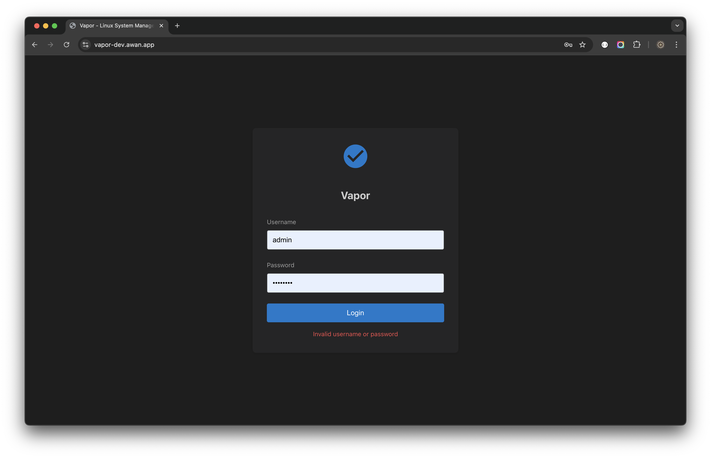

# First Login

## Overview

This guide walks you through your first login to Vapor and essential initial configuration steps to secure and customize your installation.

## Accessing Vapor

### Step 1: Open Vapor in Your Browser

Navigate to your Vapor installation:
```
http://your-server-ip:8080
```

Replace `your-server-ip` with your server's actual IP address or hostname.

### Step 2: Login Screen

You'll be greeted with the Vapor login screen:


The login screen features:
- Clean, modern interface with Vapor logo
- Username and password fields
- Blue "Login" button
- Dark theme by default

## Login Credentials

Vapor uses your Linux system credentials for authentication:
- **Username**: Your Linux username
- **Password**: Your Linux password

The system authenticates against `/etc/passwd` and `/etc/shadow`.

## Login Process

### Step 1: Enter Credentials

<!--  -->

1. Enter your username
2. Enter your password
3. Click the "Login" button or press Enter

### Step 2: Handle Login Errors

If login fails, you'll see an error message:



Common error reasons:
- Incorrect username or password
- Account locked or disabled
- Service not running properly
- Network connectivity issues

### Step 3: Successful Login

Upon successful authentication:
1. JWT token is generated and stored
2. You're redirected to the dashboard
3. Session begins with configurable timeout

## Initial Configuration

### 1. Set Strong Passwords

Ensure all user accounts have strong passwords:

1. Navigate to **Users** in the sidebar
2. Review all user accounts
3. Click **Edit** → **Change Password** for any weak passwords
4. Enter a strong password
5. Save changes

### 2. Configure JWT Secret

For production security, set a strong JWT secret:

```bash
# Generate a secure secret
openssl rand -base64 64

# Update configuration
sudo nano /etc/vapor/environment
```

Add or update:
```
JWT_SECRET=your-generated-secret-here
```

Restart Vapor:
```bash
sudo systemctl restart vapor
```

### 3. Set Session Timeout

Configure session duration for security:

1. Access system settings
2. Set appropriate timeout (recommended: 8-24 hours)
3. Enable "Remember Me" option if desired

### 4. Configure User Preferences

Customize your experience:

#### Theme Selection
- Click the 🌓 icon in the top bar
- Choose between dark and light themes
- Theme preference is saved per user

#### Language Selection
- Click the 🌐 icon in the top bar
- Select English or Bahasa Indonesia
- Interface updates immediately

## Understanding the Interface

After login, you'll see the main interface:


### Top Bar
- **Vapor Logo**: Click to return to dashboard
- **Theme Toggle** (🌓): Switch between dark/light
- **Language** (🌐): Change interface language
- **User Menu**: Shows logged-in user and logout option

### Sidebar Navigation
```
📊 Dashboard
🌐 Network
    ├── Interfaces
    ├── Bridges
    ├── Bonds
    └── VLANs
💾 Storage
    ├── Disks
    ├── LVM
    ├── RAID
    └── ...
📦 Containers
☸️ Kubernetes
📜 Logs
👥 Users
🖥️ Terminal
```

### Main Content Area
- Tabbed interface for multiple views
- Breadcrumb navigation
- Context-sensitive actions

### Status Bar
- Connection status
- System notifications
- Quick system stats

## Security Best Practices

### 1. Immediate Actions

After first login, complete these security tasks:

- [ ] Verify all accounts have strong passwords
- [ ] Set strong JWT secret
- [ ] Configure firewall rules
- [ ] Enable HTTPS
- [ ] Review user accounts
- [ ] Set up audit logging

### 2. Password Requirements

Create strong passwords with:
- Minimum 12 characters
- Mix of uppercase and lowercase
- Numbers and special characters
- No dictionary words
- Unique for each account

### 3. Account Security

- Enable account lockout after failed attempts
- Configure password expiration policies
- Regular security audits
- Monitor login activity

## User Roles and Permissions

### Administrator Role
- Full system access
- User management
- Security configuration
- All features enabled

### Standard User Role
- Limited system access
- View-only for sensitive areas
- Personal settings management

### Custom Roles
Create custom roles for:
- Read-only access
- Department-specific permissions
- Service-specific management

## Setting Up Additional Users

### Create New Users

1. Navigate to **Users** section
2. Click **Create User**
3. Fill in required information:
   - Username
   - Password
   - Groups (wheel for sudo access)
   - Home directory
4. Save the new user

### Best Practices for User Management
- One account per person
- Descriptive usernames
- Appropriate group assignments
- Regular access reviews

## Configuring Two-Factor Authentication (2FA)

### Enable 2FA (Recommended)

1. Access user settings
2. Navigate to Security tab
3. Click "Enable 2FA"
4. Scan QR code with authenticator app
5. Enter verification code
6. Save backup codes securely

### Supported 2FA Methods
- TOTP (Time-based One-Time Password)
- Backup codes for recovery
- Hardware tokens (future release)

## Session Management

### Understanding Sessions

- Sessions use JWT tokens
- Tokens expire after configured timeout
- Activity extends session automatically
- Multiple sessions supported

### Managing Active Sessions

1. View active sessions in user settings
2. See login time and location
3. Revoke suspicious sessions
4. Set session limits

## Troubleshooting Login Issues

### Cannot Access Login Page

1. **Check service status**:
   ```bash
   sudo systemctl status vapor
   ```

2. **Verify network access**:
   ```bash
   curl http://localhost:8080/health
   ```

3. **Check firewall**:
   ```bash
   sudo iptables -L | grep 8080
   ```

### Authentication Failures

1. **Verify credentials**:
   - Correct username/password
   - Caps Lock is off
   - No extra spaces

2. **Check user exists**:
   ```bash
   id username
   ```

3. **Review logs**:
   ```bash
   sudo journalctl -u vapor | grep auth
   ```

### Session Timeout

If logged out unexpectedly:
1. Check session timeout settings
2. Verify system time is correct
3. Clear browser cache/cookies
4. Try incognito/private mode

### Browser Issues

Supported browsers:
- Chrome/Chromium 90+
- Firefox 88+
- Safari 14+
- Edge 90+

Clear browser data if experiencing issues:
1. Clear cache and cookies
2. Disable extensions
3. Try different browser

## Next Steps

Now that you're logged in:

1. **Explore the Dashboard**: Get familiar with system metrics
2. **Configure Network**: Set up network interfaces if needed
3. **Review Storage**: Check disk usage and configuration
4. **Set Up Monitoring**: Configure alerts and notifications
5. **Create Backups**: Set up automated backups

Continue to [User Interface Guide](04-user-interface.md) to learn about navigating Vapor effectively.

---

[← Previous: Installation](02-installation.md) | [Next: User Interface →](04-user-interface.md)
