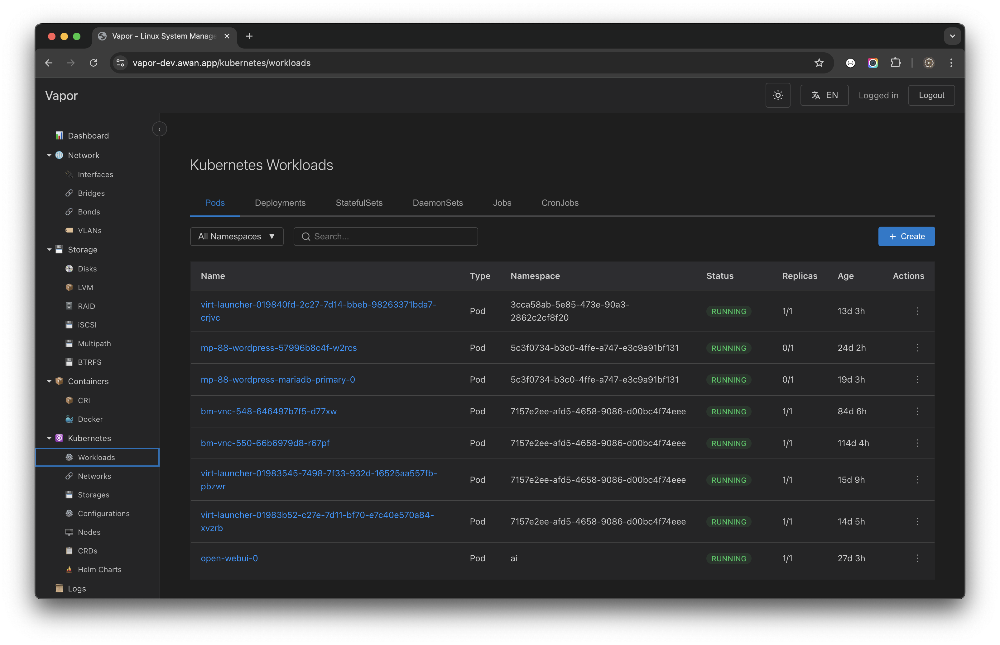
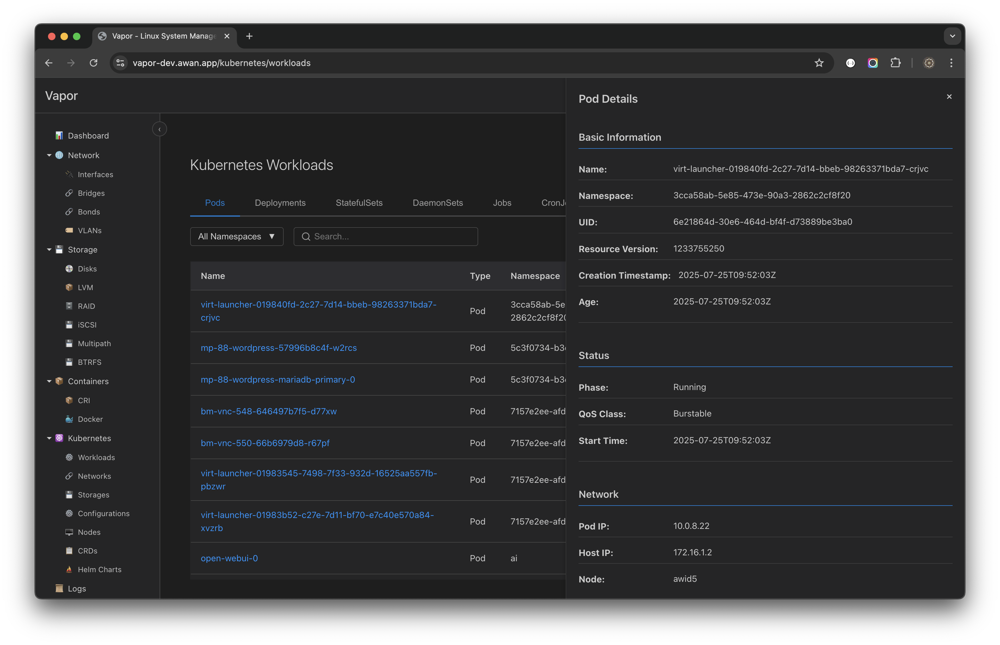
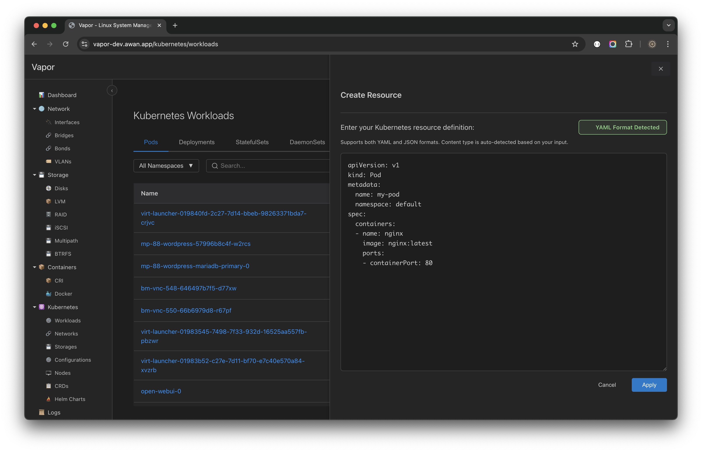
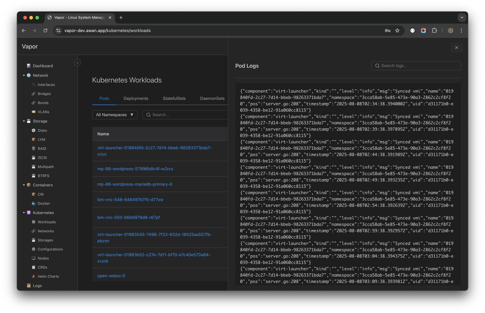
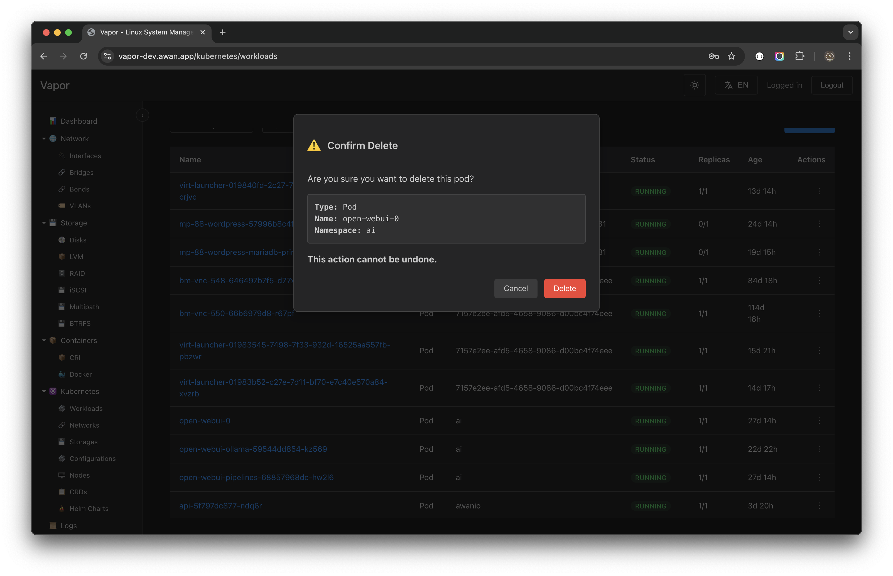

# Kubernetes Management

## Overview

Vapor provides comprehensive Kubernetes cluster management capabilities, allowing you to manage workloads, monitor resources, and deploy applications directly from the web interface. The Kubernetes section integrates seamlessly with your cluster, providing both basic operations and advanced features like Helm chart management.

## Accessing Kubernetes Features

Navigate to the Kubernetes section through the sidebar:

```
Kubernetes
├── Workloads     (Pods, Deployments, StatefulSets, etc.)
├── Networks      (Services, Ingresses, NetworkPolicies)
├── Storages      (PVCs, PVs, StorageClasses)
├── Configurations (ConfigMaps, Secrets)
├── Nodes         (Cluster nodes and resources)
├── CRDs          (Custom Resource Definitions)
└── Helm Charts   (Package management)
```

## Workloads Management

### Pods

The Pods view provides comprehensive pod management:



#### Pod List Features

**Namespace Filtering**
- Select "All Namespaces" or specific namespace
- Quick namespace switching
- Namespace isolation for security

**Search and Filter**
- Real-time search by pod name
- Filter by status (Running, Pending, Failed)
- Sort by age, status, or resource usage

**Status Indicators**
- 🟢 **RUNNING**: Pod is healthy and running
- 🟡 **PENDING**: Pod is being scheduled or starting
- 🔴 **FAILED**: Pod has crashed or failed to start
- 🟠 **UNKNOWN**: Pod status cannot be determined

#### Pod Information Display

Each pod entry shows:
- **Name**: Full pod identifier
- **Namespace**: Kubernetes namespace
- **Status**: Current pod state
- **Replicas**: Number of containers
- **Age**: Time since creation
- **Actions**: Quick action menu

### Pod Details

Click on any pod to view detailed information:



#### Basic Information
```yaml
Name:              virt-launcher-019840fd-2c27-7d14-bbeb-98263371bda7-cnjvc
Namespace:         3cca58ab-5e85-473e-90a3-2862c2cf8f20
UID:               6e21864d-30e6-464d-bf4f-d73889bc3ba0
Resource Version:  1233755250
Creation Time:     2025-07-25T09:52:03Z
Age:               13 days, 3 hours
```

#### Status Information
```yaml
Phase:       Running
QoS Class:   Burstable
Start Time:  2025-07-25T09:52:03Z
```

#### Network Information
```yaml
Pod IP:      10.0.8.22
Host IP:     172.16.1.2
Node:        avid5
```

### Creating Resources

Vapor supports creating Kubernetes resources using YAML or JSON:



#### Resource Creation Process

1. **Click "Create" button** in the workloads view
2. **Enter resource definition** in YAML or JSON format
3. **Format auto-detection** identifies the syntax
4. **Validation** occurs before submission
5. **Apply** to create the resource

#### Example Pod Creation

```yaml
apiVersion: v1
kind: Pod
metadata:
  name: my-pod
  namespace: default
spec:
  containers:
  - name: nginx
    image: nginx:latest
    ports:
    - containerPort: 80
```

### Pod Operations

#### Viewing Logs

Access real-time pod logs:



**Log Features:**
- Real-time streaming
- Search within logs
- Timestamp display
- JSON formatting for structured logs
- Export capabilities

#### Deleting Pods

Safe deletion with confirmation:



**Deletion Safety:**
- Confirmation dialog shows pod details
- Warning about permanent deletion
- Namespace verification
- Cancel option available

## Deployments

Manage application deployments with:

### Deployment Features
- **Scaling**: Adjust replica count
- **Rolling Updates**: Zero-downtime deployments
- **Rollback**: Revert to previous versions
- **Strategy Configuration**: RollingUpdate or Recreate

### Creating a Deployment

```yaml
apiVersion: apps/v1
kind: Deployment
metadata:
  name: nginx-deployment
  namespace: default
spec:
  replicas: 3
  selector:
    matchLabels:
      app: nginx
  template:
    metadata:
      labels:
        app: nginx
    spec:
      containers:
      - name: nginx
        image: nginx:1.21
        ports:
        - containerPort: 80
```

### Deployment Operations
- **Scale**: Adjust replica count up or down
- **Update**: Change image or configuration
- **Pause/Resume**: Control rollout process
- **History**: View revision history

## StatefulSets

For stateful applications requiring:
- Stable network identities
- Persistent storage
- Ordered deployment and scaling
- Ordered termination

### StatefulSet Example

```yaml
apiVersion: apps/v1
kind: StatefulSet
metadata:
  name: mysql
spec:
  serviceName: mysql
  replicas: 3
  selector:
    matchLabels:
      app: mysql
  template:
    metadata:
      labels:
        app: mysql
    spec:
      containers:
      - name: mysql
        image: mysql:8.0
        env:
        - name: MYSQL_ROOT_PASSWORD
          value: "secretpassword"
        volumeMounts:
        - name: mysql-storage
          mountPath: /var/lib/mysql
  volumeClaimTemplates:
  - metadata:
      name: mysql-storage
    spec:
      accessModes: ["ReadWriteOnce"]
      resources:
        requests:
          storage: 10Gi
```

## DaemonSets

Deploy pods on every node:
- Log collectors
- Monitoring agents
- Network plugins
- Storage daemons

## Jobs and CronJobs

### Jobs
One-time tasks:
- Data processing
- Batch operations
- Maintenance tasks

### CronJobs
Scheduled recurring tasks:
- Backups
- Report generation
- Cleanup operations

## Networking

### Services

Expose applications within the cluster:

```yaml
apiVersion: v1
kind: Service
metadata:
  name: nginx-service
spec:
  selector:
    app: nginx
  ports:
  - protocol: TCP
    port: 80
    targetPort: 80
  type: ClusterIP
```

**Service Types:**
- **ClusterIP**: Internal cluster access
- **NodePort**: External access via node ports
- **LoadBalancer**: Cloud provider load balancer
- **ExternalName**: DNS CNAME record

### Ingresses

HTTP/HTTPS routing:

```yaml
apiVersion: networking.k8s.io/v1
kind: Ingress
metadata:
  name: nginx-ingress
spec:
  rules:
  - host: app.example.com
    http:
      paths:
      - path: /
        pathType: Prefix
        backend:
          service:
            name: nginx-service
            port:
              number: 80
```

## Storage

### Persistent Volume Claims (PVCs)

Request storage for pods:

```yaml
apiVersion: v1
kind: PersistentVolumeClaim
metadata:
  name: mysql-pvc
spec:
  accessModes:
    - ReadWriteOnce
  resources:
    requests:
      storage: 20Gi
  storageClassName: fast-ssd
```

### Storage Classes

Define storage types:
- Performance tiers
- Backup policies
- Encryption settings
- Provisioner configuration

## Configuration

### ConfigMaps

Store configuration data:

```yaml
apiVersion: v1
kind: ConfigMap
metadata:
  name: app-config
data:
  database.conf: |
    host=localhost
    port=5432
    name=myapp
  app.properties: |
    debug=false
    version=1.0.0
```

### Secrets

Manage sensitive data:

```yaml
apiVersion: v1
kind: Secret
metadata:
  name: mysql-secret
type: Opaque
data:
  password: cGFzc3dvcmQxMjM=  # base64 encoded
```

## Helm Chart Management

Vapor includes full Helm support:

### Helm Operations
- **List Releases**: View all deployed charts
- **Install Charts**: Deploy from repositories
- **Upgrade Releases**: Update to new versions
- **Rollback**: Revert to previous releases
- **Uninstall**: Remove deployed charts

### Installing a Helm Chart

```bash
# Example: Installing Prometheus
helm repo add prometheus-community https://prometheus-community.github.io/helm-charts
helm install prometheus prometheus-community/prometheus
```

### Managing Releases

View and manage Helm releases:
- Release name and namespace
- Chart version
- App version
- Status (deployed, failed, pending)
- Last updated timestamp

## Custom Resource Definitions (CRDs)

Extend Kubernetes with custom resources:

### Viewing CRDs
- List all installed CRDs
- View CRD details and versions
- Access custom resources
- Monitor CRD status

### Common CRDs
- Cert-manager certificates
- Istio service mesh
- Prometheus monitoring
- Operator-managed resources

## Node Management

Monitor cluster nodes:
- Resource allocation
- Pod scheduling
- Node conditions
- Taints and tolerations

## Best Practices

### Resource Management
1. **Set resource limits**: Prevent resource exhaustion
2. **Use namespaces**: Isolate workloads
3. **Label consistently**: Easier management
4. **Monitor resources**: Track usage patterns

### Security
1. **Use RBAC**: Role-based access control
2. **Secure secrets**: Encrypt sensitive data
3. **Network policies**: Control traffic flow
4. **Pod security**: Use security contexts

### High Availability
1. **Multiple replicas**: Avoid single points of failure
2. **Pod disruption budgets**: Control maintenance
3. **Liveness probes**: Automatic recovery
4. **Readiness probes**: Traffic management

## Troubleshooting

### Common Issues

#### Pods Not Starting
1. Check pod events
2. Review container logs
3. Verify image availability
4. Check resource constraints

#### Service Discovery
1. Verify service selectors
2. Check endpoint creation
3. Test DNS resolution
4. Validate network policies

#### Storage Issues
1. Check PVC binding
2. Verify storage class
3. Review volume permissions
4. Monitor disk space

## Integration with CI/CD

Vapor's Kubernetes features integrate with:
- GitOps workflows
- CI/CD pipelines
- Helm charts
- Kubectl commands

## Next Steps

- Explore [Container Management](08-container-management.md)
- Learn about [API Integration](13-api-reference.md#kubernetes)
- Review [Security Best Practices](14-security.md#kubernetes)

---

[← Previous: Container Management](08-container-management.md) | [Next: User Management →](10-user-management.md)
