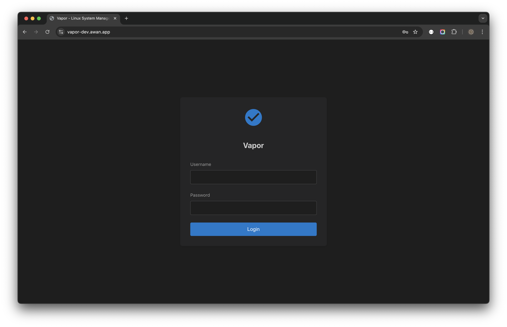
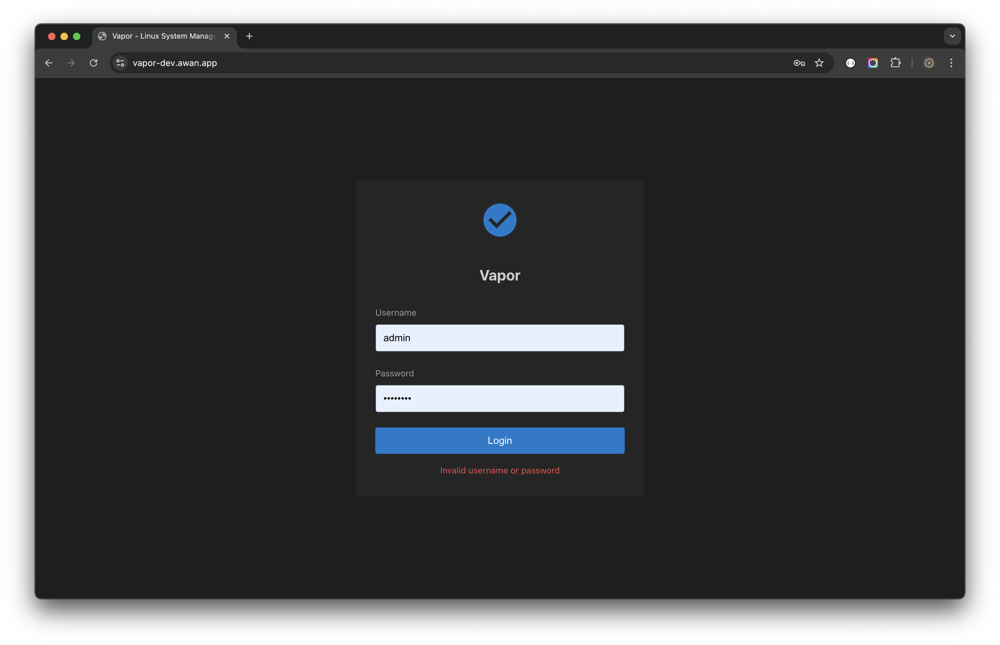

# Login Pertama

## Gambaran Umum

Panduan ini memandu Anda melalui login pertama ke Vapor dan langkah-langkah konfigurasi awal yang penting untuk mengamankan dan menyesuaikan instalasi Anda.

## Mengakses Vapor

### Langkah 1: Buka Vapor di Browser Anda

Navigasi ke instalasi Vapor Anda:
```
http://alamat-ip-server-anda:8080
```

Ganti `alamat-ip-server-anda` dengan alamat IP atau hostname server Anda yang sebenarnya.

### Langkah 2: Layar Login

Anda akan disambut dengan layar login Vapor:



Layar login menampilkan:
- Antarmuka modern yang bersih dengan logo Vapor
- Field username dan password
- Tombol "Login" biru
- Tema gelap secara default

## Kredensial Login

Vapor menggunakan kredensial sistem Linux Anda untuk autentikasi:
- **Username**: Username Linux Anda
- **Password**: Password Linux Anda

Sistem melakukan autentikasi terhadap `/etc/passwd` dan `/etc/shadow`.

## Proses Login

### Langkah 1: Masukkan Kredensial

<!--  -->

1. Masukkan username Anda
2. Masukkan password Anda
3. Klik tombol "Login" atau tekan Enter

### Langkah 2: Menangani Error Login

Jika login gagal, Anda akan melihat pesan error:



Alasan error umum:
- Username atau password salah
- Akun terkunci atau dinonaktifkan
- Layanan tidak berjalan dengan benar
- Masalah konektivitas jaringan

### Langkah 3: Login Berhasil

Setelah autentikasi berhasil:
1. Token JWT dibuat dan disimpan
2. Anda diarahkan ke dashboard
3. Sesi dimulai dengan timeout yang dapat dikonfigurasi

## Konfigurasi Awal

### 1. Atur Password Kuat

Pastikan semua akun pengguna memiliki password yang kuat:

1. Navigasi ke **Users** di sidebar
2. Tinjau semua akun pengguna
3. Klik **Edit** → **Change Password** untuk password yang lemah
4. Masukkan password yang kuat
5. Simpan perubahan

### 2. Konfigurasi JWT Secret

Untuk keamanan produksi, atur JWT secret yang kuat:

```bash
# Generate secret yang aman
openssl rand -base64 64

# Update konfigurasi
sudo nano /etc/vapor/environment
```

Tambahkan atau update:
```
JWT_SECRET=secret-yang-anda-generate-di-sini
```

Restart Vapor:
```bash
sudo systemctl restart vapor
```

### 3. Atur Timeout Sesi

Konfigurasi durasi sesi untuk keamanan:

1. Akses pengaturan sistem
2. Atur timeout yang sesuai (direkomendasikan: 8-24 jam)
3. Aktifkan opsi "Remember Me" jika diinginkan

### 4. Konfigurasi Preferensi Pengguna

Sesuaikan pengalaman Anda:

#### Pemilihan Tema
- Klik ikon 🌓 di top bar
- Pilih antara tema gelap dan terang
- Preferensi tema disimpan per pengguna

#### Pemilihan Bahasa
- Klik ikon 🌐 di top bar
- Pilih English atau Bahasa Indonesia
- Antarmuka diperbarui segera

## Memahami Antarmuka

Setelah login, Anda akan melihat antarmuka utama:


### Top Bar
- **Logo Vapor**: Klik untuk kembali ke dashboard
- **Toggle Tema** (🌓): Beralih antara gelap/terang
- **Bahasa** (🌐): Ubah bahasa antarmuka
- **Menu Pengguna**: Menampilkan pengguna yang login dan opsi logout

### Navigasi Sidebar
```
📊 Dashboard
🌐 Network
    ├── Interfaces
    ├── Bridges
    ├── Bonds
    └── VLANs
💾 Storage
    ├── Disks
    ├── LVM
    ├── RAID
    └── ...
📦 Containers
☸️ Kubernetes
📜 Logs
👥 Users
🖥️ Terminal
```

### Area Konten Utama
- Antarmuka bertab untuk beberapa tampilan
- Navigasi breadcrumb
- Aksi sensitif konteks

### Status Bar
- Status koneksi
- Notifikasi sistem
- Statistik sistem cepat

## Praktik Terbaik Keamanan

### 1. Tindakan Segera

Setelah login pertama, selesaikan tugas keamanan ini:

- [ ] Verifikasi semua akun memiliki password kuat
- [ ] Atur JWT secret yang kuat
- [ ] Konfigurasi aturan firewall
- [ ] Aktifkan HTTPS
- [ ] Tinjau akun pengguna
- [ ] Atur audit logging

### 2. Persyaratan Password

Buat password kuat dengan:
- Minimal 12 karakter
- Campuran huruf besar dan kecil
- Angka dan karakter khusus
- Tidak ada kata kamus
- Unik untuk setiap akun

### 3. Keamanan Akun

- Aktifkan penguncian akun setelah percobaan gagal
- Konfigurasi kebijakan kadaluarsa password
- Audit keamanan reguler
- Monitor aktivitas login

## Peran dan Izin Pengguna

### Peran Administrator
- Akses sistem penuh
- Manajemen pengguna
- Konfigurasi keamanan
- Semua fitur diaktifkan

### Peran Pengguna Standar
- Akses sistem terbatas
- Hanya-lihat untuk area sensitif
- Manajemen pengaturan pribadi

### Peran Kustom
Buat peran kustom untuk:
- Akses hanya-baca
- Izin spesifik departemen
- Manajemen spesifik layanan

## Mengatur Pengguna Tambahan

### Buat Pengguna Baru

1. Navigasi ke bagian **Users**
2. Klik **Create User**
3. Isi informasi yang diperlukan:
   - Username
   - Password
   - Groups (wheel untuk akses sudo)
   - Home directory
4. Simpan pengguna baru

### Praktik Terbaik untuk Manajemen Pengguna
- Satu akun per orang
- Username deskriptif
- Penugasan grup yang sesuai
- Tinjauan akses reguler

## Mengkonfigurasi Autentikasi Dua Faktor (2FA)

### Aktifkan 2FA (Direkomendasikan)

1. Akses pengaturan pengguna
2. Navigasi ke tab Security
3. Klik "Enable 2FA"
4. Scan kode QR dengan aplikasi authenticator
5. Masukkan kode verifikasi
6. Simpan kode backup dengan aman

### Metode 2FA yang Didukung
- TOTP (Time-based One-Time Password)
- Kode backup untuk pemulihan
- Token hardware (rilis mendatang)

## Manajemen Sesi

### Memahami Sesi

- Sesi menggunakan token JWT
- Token kadaluarsa setelah timeout yang dikonfigurasi
- Aktivitas memperpanjang sesi secara otomatis
- Beberapa sesi didukung

### Mengelola Sesi Aktif

1. Lihat sesi aktif di pengaturan pengguna
2. Lihat waktu dan lokasi login
3. Cabut sesi yang mencurigakan
4. Atur batas sesi

## Pemecahan Masalah Login

### Tidak Dapat Mengakses Halaman Login

1. **Periksa status layanan**:
   ```bash
   sudo systemctl status vapor
   ```

2. **Verifikasi akses jaringan**:
   ```bash
   curl http://localhost:8080/health
   ```

3. **Periksa firewall**:
   ```bash
   sudo iptables -L | grep 8080
   ```

### Kegagalan Autentikasi

1. **Verifikasi kredensial**:
   - Username/password yang benar
   - Caps Lock mati
   - Tidak ada spasi tambahan

2. **Periksa pengguna ada**:
   ```bash
   id username
   ```

3. **Tinjau log**:
   ```bash
   sudo journalctl -u vapor | grep auth
   ```

### Timeout Sesi

Jika logout tiba-tiba:
1. Periksa pengaturan timeout sesi
2. Verifikasi waktu sistem benar
3. Bersihkan cache/cookie browser
4. Coba mode incognito/private

### Masalah Browser

Browser yang didukung:
- Chrome/Chromium 90+
- Firefox 88+
- Safari 14+
- Edge 90+

Bersihkan data browser jika mengalami masalah:
1. Bersihkan cache dan cookie
2. Nonaktifkan ekstensi
3. Coba browser berbeda

## Langkah Selanjutnya

Sekarang setelah Anda login:

1. **Jelajahi Dashboard**: Kenali metrik sistem
2. **Konfigurasi Jaringan**: Atur interface jaringan jika diperlukan
3. **Tinjau Penyimpanan**: Periksa penggunaan dan konfigurasi disk
4. **Atur Monitoring**: Konfigurasi alert dan notifikasi
5. **Buat Backup**: Atur backup otomatis

Lanjutkan ke [Panduan Antarmuka Pengguna](04-user-interface.md) untuk mempelajari cara menavigasi Vapor secara efektif.

---

[← Sebelumnya: Instalasi](02-installation.md) | [Selanjutnya: Antarmuka Pengguna →](04-user-interface.md)
