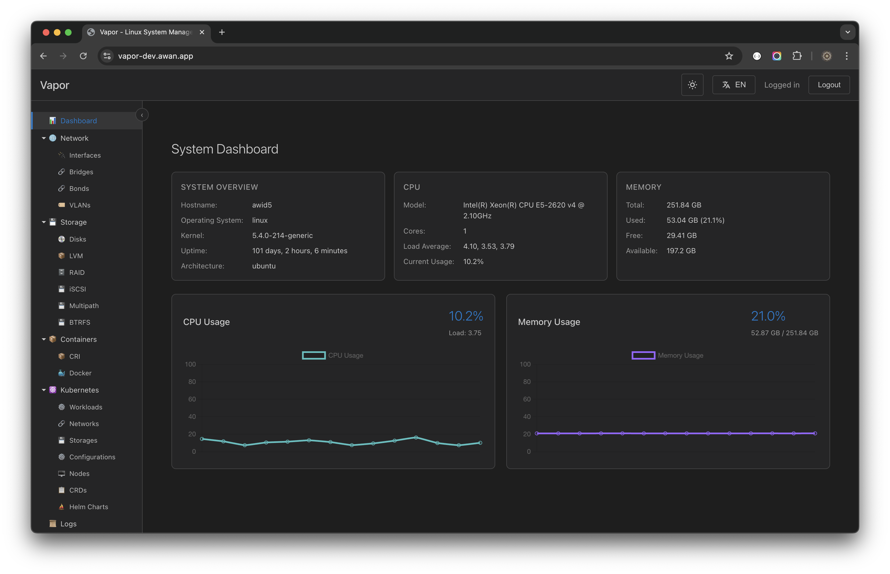

# Panduan Antarmuka Pengguna

## Gambaran Umum

Vapor memiliki antarmuka modern dan intuitif dengan desain yang bersih. Panduan ini akan membantu Anda menavigasi dan menggunakan antarmuka secara efektif.

## Tata Letak Antarmuka



Antarmuka Vapor terdiri dari empat area utama:

### 1. Top Bar
Terletak di bagian atas layar:
- **Logo Vapor**: Link Home/Dashboard
- **Spacer**: Ruang fleksibel
- **Toggle Tema** (🌓): Beralih tema gelap/terang
- **Pemilih Bahasa** (🌐): Beralih bahasa EN/ID
- **Menu Pengguna**: Pengguna yang login dan logout

### 2. Sidebar
Panel navigasi yang dapat dilipat di sebelah kiri:
- Navigasi gaya pohon
- Bagian yang dapat diperluas
- Penyorotan item aktif
- Dukungan navigasi keyboard

### 3. Area Konten Utama
Ruang kerja pusat menampilkan:
- Antarmuka bertab
- Beberapa tampilan terbuka
- Navigasi breadcrumb
- Konten spesifik konteks

### 4. Status Bar
Panel informasi bawah:
- Status koneksi
- Pesan sistem
- Statistik cepat
- Indikator aktivitas

## Navigasi

### Navigasi Sidebar

Sidebar menggunakan struktur pohon hierarkis:

```
Vapor
├── 📊 Dashboard          (Gambaran sistem)
├── 🌐 Network           (Manajemen jaringan)
│   ├── Interfaces       (Interface jaringan)
│   ├── Bridges          (Bridge jaringan)
│   ├── Bonds            (Network bonding)
│   └── VLANs           (Konfigurasi VLAN)
├── 💾 Storage           (Manajemen penyimpanan)
│   ├── Disks           (Disk fisik)
│   ├── LVM             (Volume logis)
│   ├── RAID            (Array RAID)
│   ├── iSCSI           (Target iSCSI)
│   ├── Multipath       (Perangkat multipath)
│   └── BTRFS           (Volume BTRFS)
├── 📦 Containers        (Manajemen kontainer)
│   ├── CRI             (Kontainer CRI)
│   └── Docker          (Kontainer Docker)
├── ☸️ Kubernetes        (Manajemen K8s)
│   ├── Workloads       (Pod, Deployment)
│   ├── Networks        (Service, Ingress)
│   ├── Storages        (PVC, StorageClass)
│   ├── Configurations  (ConfigMap, Secret)
│   ├── Nodes           (Node cluster)
│   ├── CRDs            (Resource kustom)
│   └── Helm Charts     (Manajemen paket)
├── 📜 Logs              (Log sistem)
├── 👥 Users             (Manajemen pengguna)
└── 🖥️ Terminal          (Terminal web)
```

## Tema

### Tema Gelap (Default)
- Mengurangi ketegangan mata
- Lebih baik untuk sesi panjang
- Kontras yang dioptimalkan
- Skema warna modern

### Tema Terang
- Lebih baik di lingkungan terang
- Ramah cetak
- Kontras tinggi
- Tampilan bersih

### Mengganti Tema
1. Klik ikon 🌓 di top bar
2. Tema berubah segera
3. Preferensi disimpan otomatis
4. Pengaturan per pengguna

## Dukungan Bahasa

### Bahasa yang Tersedia
- **English (EN)**: Bahasa default
- **Bahasa Indonesia (ID)**: Terjemahan lengkap

### Mengganti Bahasa
1. Klik 🌐 di top bar
2. Pilih bahasa yang diinginkan
3. Antarmuka diperbarui instan
4. Termasuk semua teks dan format

### Fitur Bahasa
- Elemen UI yang diterjemahkan
- Format tanggal/waktu lokal
- Format angka
- Pesan error
- Dokumentasi bantuan

## Elemen UI Umum

### Tombol

#### Tombol Primer
- Latar belakang biru
- Aksi utama (Buat, Simpan, Terapkan)
- Dapat diakses keyboard

#### Tombol Sekunder
- Gaya outline
- Aksi sekunder (Batal, Tutup)
- Penekanan lebih sedikit

#### Tombol Bahaya
- Warna merah
- Aksi destruktif (Hapus, Buang)
- Memerlukan konfirmasi

### Formulir

#### Field Input
- Label jelas
- Teks placeholder
- Umpan balik validasi
- Pesan error

#### Dropdown
- Fungsi pencarian
- Dukungan multi-select
- Navigasi keyboard
- Hapus seleksi

### Tabel

#### Fitur
- Kolom dapat diurutkan
- Cari/filter
- Paginasi
- Seleksi baris
- Kolom aksi

#### Interaksi Tabel
- Klik header untuk mengurutkan
- Gunakan kotak pencarian untuk filter
- Pilih baris untuk aksi massal
- Klik aksi untuk operasi baris

### Modal

#### Tipe Modal
- **Informasi**: Tampilkan detail
- **Konfirmasi**: Verifikasi aksi
- **Formulir**: Input data
- **Wizard**: Proses multi-langkah

#### Kontrol Modal
- Tombol tutup (×)
- Tombol Batal/OK
- Tombol Escape untuk menutup
- Klik di luar untuk menutup (opsional)

## Pembaruan Real-time

### Indikator WebSocket
- 🟢 Terhubung - Real-time aktif
- 🟡 Menghubungkan - Membangun koneksi
- 🔴 Terputus - Tidak ada data real-time

### Auto-refresh
- Metrik dashboard
- Status kontainer
- Log streaming
- Event sistem

## Desain Responsif

### Pengalaman Desktop
- Navigasi sidebar penuh
- Beberapa kolom
- Interaksi hover
- Pintasan keyboard

### Pengalaman Tablet
- Sidebar dapat dilipat
- Dioptimalkan untuk sentuhan
- Tata letak disederhanakan
- Dukungan gesture

### Pengalaman Mobile
- Menu hamburger
- Kolom tunggal
- Target sentuh
- Antarmuka disederhanakan

## Aksesibilitas

### Dukungan Keyboard
- Navigasi keyboard penuh
- Indikator fokus
- Link skip
- Tombol pintasan

### Screen Reader
- Label ARIA
- HTML semantik
- Pengumuman status
- Deskripsi formulir

### Bantuan Visual
- Mode kontras tinggi
- Outline fokus
- Indikator error
- Status loading

## Performa

### Fitur Optimasi
- Lazy loading
- Virtual scrolling
- Update efisien
- Cache resource

### Praktik Terbaik
- Tutup tab yang tidak digunakan
- Gunakan filter di daftar besar
- Aktifkan paginasi
- Batasi update real-time

## Kustomisasi

### Preferensi Pengguna
- Pemilihan tema
- Pilihan bahasa
- Tata letak dashboard
- Pengaturan notifikasi

### Ruang Kerja
- Pengaturan tab
- Lebar sidebar
- Preferensi tampilan
- Urutan sortir

## Tips dan Trik

### Tips Produktivitas
1. **Gunakan pintasan keyboard** untuk navigasi lebih cepat
2. **Pin tab yang sering digunakan** untuk akses cepat
3. **Kustomisasi dashboard** untuk alur kerja Anda
4. **Gunakan pencarian** daripada browsing
5. **Atur filter** untuk tampilan umum

### Tips Antarmuka
1. **Klik dua kali** border sidebar untuk reset lebar
2. **Klik tengah** link untuk buka di tab baru
3. **Shift-klik** untuk memilih beberapa item
4. **Ctrl-klik** untuk seleksi tidak berurutan
5. **Klik kanan** untuk menu konteks

## Pemecahan Masalah UI

### Masalah Tampilan
- Bersihkan cache browser
- Periksa level zoom (Ctrl+0 untuk reset)
- Nonaktifkan ekstensi browser
- Coba browser berbeda

### Masalah Performa
- Tutup tab yang tidak perlu
- Kurangi frekuensi update
- Periksa koneksi jaringan
- Monitor resource browser

### Elemen Hilang
- Refresh halaman (F5)
- Periksa izin
- Verifikasi ketersediaan fitur
- Tinjau error console

## Langkah Selanjutnya

Sekarang setelah Anda memahami antarmuka:
- Jelajahi [Dashboard](05-dashboard.md)
- Pelajari [Manajemen Jaringan](06-network-management.md)
- Konfigurasi [Preferensi Pengguna](10-user-management.md)

---

[← Sebelumnya: Login Pertama](03-first-login.md) | [Selanjutnya: Dashboard →](05-dashboard.md)
